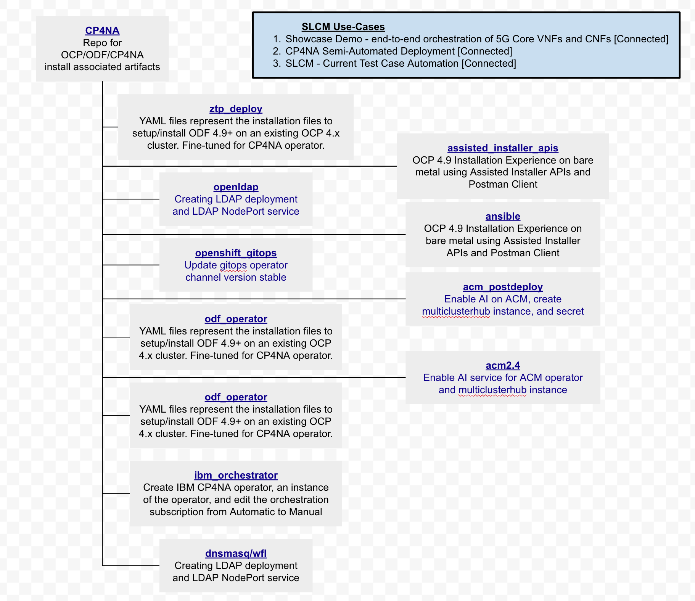

= IBM CP4NA SLCM

:project-document-summary: https://docs.google.com/document/d/1tvVd-30InHZyhXS2DbVL-1ZGfw6-YnkqjhUiONaMmS4/edit#

:main-jira-epic: https://issues.redhat.com/browse/SHOWCASE-14

The goal of the SLCM project is to provide automated platform testing with simulated, and potential actual workloads, in support of the IBM CP4NA partnership.

The goals and background to the project is described in document {project-document-summary}[IBM CP4NA - Test Harness] and activities are tracked under the epic {main-jira-epic}[SHOWCASE-14]

In this setup, the OCP cluster is installer with baremetal installer(IPI) and PXE. In the lab, only one host has been used for both Jumphost, provisioner and dns/dhcp server.

== Repo structure

This, the main partner-specific repository interacts with one other repository:


:cp4na-repo-structure: ../images


=== Submodules

The way this repo interacts with other repositories is by using Git submodules. Specifically the following ones:

* Test Harness Common
* SLCM CI-CD
* DU Workload

To update them run the commands:

```bash
git submodule init
git submodule update
```